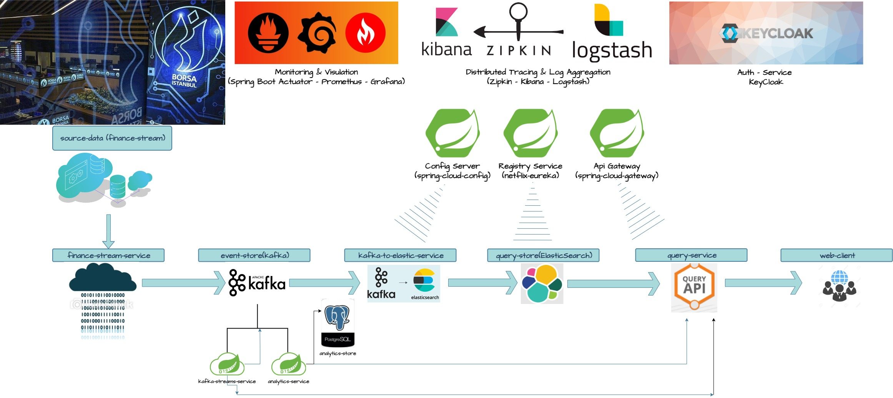
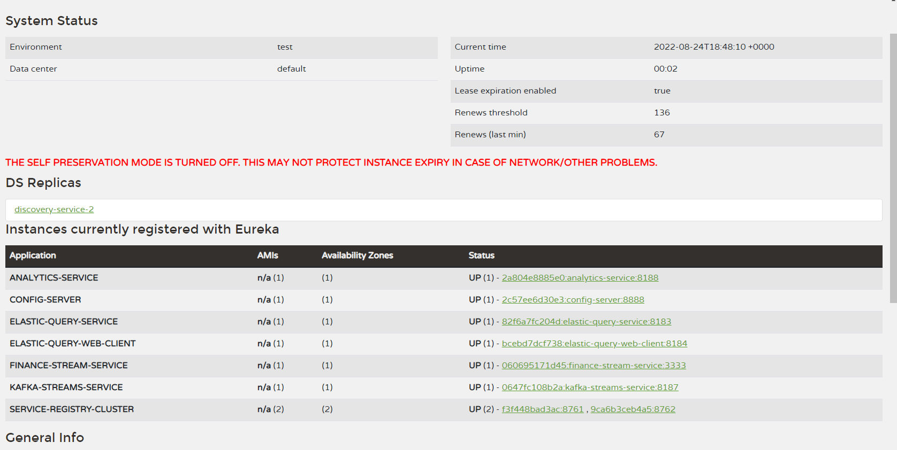
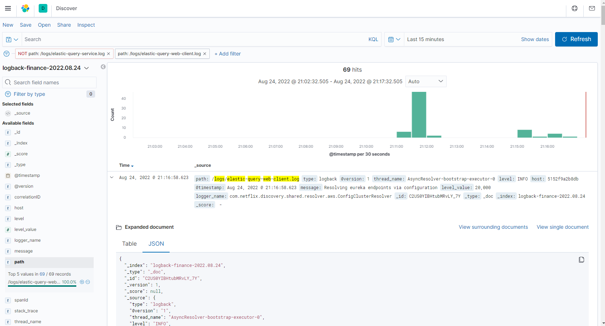
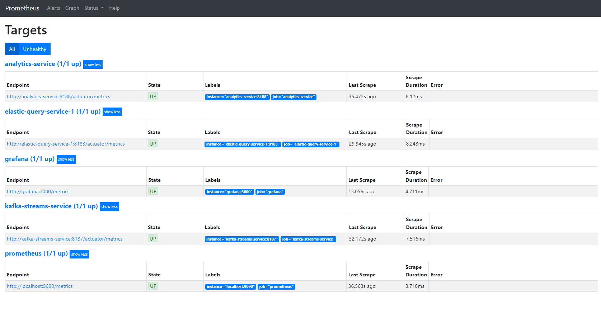

## Small summary : 
### As a summary of the project, it is a project that takes the values of some stock market shares in BIST, thanks to the finance-stream-service, adds them to elasticsearch and creates a cloud stream with the data it receives and aims to use the data received by other services.

## Some pictures on project...

### Project Properties:

    - Java 17
    - Intellij
    - Maven
    - Git
    - Docker

### Desing Pattern Properties:

- Microservices
- Modular architecture
- Reusable modules
- Independent develop
- Independent deploy 
- Messaging 
- Event-driven
- Event sourcing
- CQRS
- Externalized config
- Api Gateway
- Circuit Breaker
- Service Discovery
- Log aggreation
- Distributed tracing
- Monitoring
- Authentication/Authorization
- Database per service

### Services Proterties:

**Config Server**

- Externalized config pattern
- Define config git repository
- Connect to github
- Security configuration
- Enable encryption for sensitive data

**Api Gateway**

- Spring cloud gateway
- Client side load balancing
- Circuit breaker & fallbacks with resilience4j
- Rate limiting with redis
- Docker redis

**Registry Service**
- Service discovery and registration with netflix eureka
- High availability

**Auth Service**
- Keycloak authz server docker
- Oauth2, open id connect
- Jwt
- Spring oauth2 resource server
- Spring oauth2 client
- Single sign-on

**Finance Stream Service**

- Spring boot
- Kafka basics
- Spring-kafka (producer)
- Kafka avro
- Kafka admin
- Docker kafka
- Maven basics 
- Logback
- Feign Client

**Kafka To Elastic Service**
- Elasticsearch basics
- Elastic index
- Docker elastic
- Spring-elastic
- Spring-kafka (consumer)

**Query Service**
- Spring web
- Hateoas
- Controller advice
- Api versioning 
- Elastic query
- Open api docs
- Reactive query with elastic

**Web Api**
- Spring Webclient
- Spring thymeleaf
- Bootstrap
- Reactive webclient and thymeleaf
- Client side Load balancing

**Analystic Service**
- Spring data (postgresql)
- CRUD
- Batch inserts with spring data jpa

**Kafka Streams Service**
- Kafka streams
- Kafka key/value stores

**Monitoring & Visulation**
- Spring boot actuator
- Prometheus metrics
- Grafana visualization

**Log & Aggregation**
- Log aggregation
- Distributed tracing 
- Logback & Logstash
- Kibana visualization

